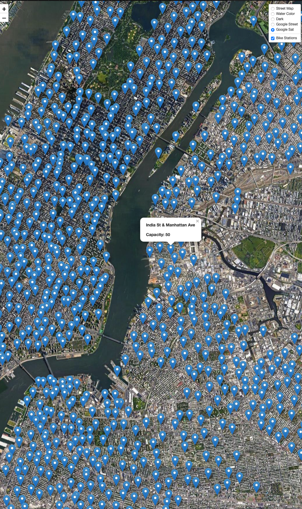

# Citi Bike Maps
A mini project on Leaflet  using citi Bike API  to get the status and location of every Citi Bike station in New York. The following steps are followed.

Citi Bike station information endpoint is used to get information about the station names and locations.

1. Each object in the stations array has station_id, name, capacity, lat, and lon properties.

2. A function named createMap was created that takes bikeStations as an argument. This function created both the tile layer and an overlay with the pins for each station.

3. Using d3, json data was retrieved from the Citi Bike station information endpoint.

4. The following image shows the basic map:

The website is deployed to GitHub at:
https://pandeysudip.github.io/newyork-bike/
